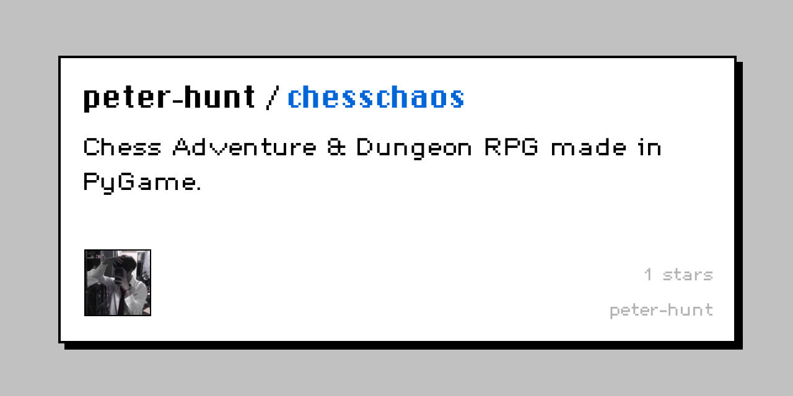

# ChessChaos




## ChessChaos RPG made in PyGame

**(the following is the description of what this game will be like when finished!)**

_ChessChaos is a tactic adventure story set in Chaos of Chess, where pieces have special abilities. You are a survivor of the last chess apocalypse. You can obtain chess piece variants with special abilities, play against wicked creatures, adventure the wild or crawl the dungeons, conquer the Chaos of Chess._

Currently, only the a few playable chess positions are added. The design of the game features can be seen [here](./design.md)

# Table of Contents
- [ChessChaos](#chesschaos)
  - [ChessChaos RPG made in PyGame](#chesschaos-rpg-made-in-pygame)
- [Table of Contents](#table-of-contents)
- [Credits](#credits)
- [License](#license)
- [Warnings](#warnings)
- [Installation](#installation)
- [Usage](#usage)
- [Content](#content)
  - [Added Features](#added-features)
  - [Planned Features](#planned-features)
- [How to Contribute](#how-to-contribute)
# Credits

Social preview image generated by [Bannerbear](https://bannerbear.com).

# License

[MIT](LICENSE.txt)

# Warnings

**This project is still under heavy development**, so the data structures used for caching and saving data will change. If you'd like to play this game in the Alpha version, and your saved files get out of date or just from strange bugs, your files can corrupt.

If your data folder corrupts, delete the files under `saves` folder to let the program fix it.

If your saved files go corrupt, then it's probably not going to be resolved.

# Installation

Use git to install ChessChaos from the source.

```bash
git clone https://github.com/peter-hunt/chesschaos.git
```

**This project requires Python 3.8+**

# Usage

Go to the subfolder of project folder and execute the following command.

```bash
python -m chesschaos
```

Upon successful execution of the project, you should see this: 

# Content

## Added Features

- Classic Mode (chess puzzles, not limited to legal chess boards)

## Planned Features

The game design of ChessChaos can be seen [here](./design.md)

- Adventure Mode (chess pieces have health, damage, defense, and abilities)
- Configurable chess pieces styles and a more RPG style as default
- Currency and Shops
- Dungeon Mode (dungeons with adventure mode combat system)
- Items and Inventory
- Levels and maybe Skills
- Randomly generated levels configurable with estimated power

# How to Contribute

[CONTRIBUTING.md](./CONTRIBUTING.md)
